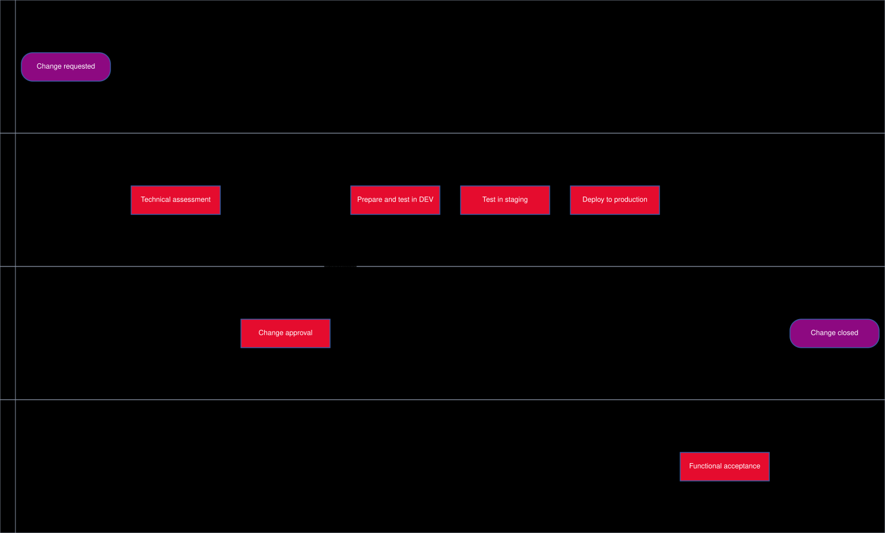
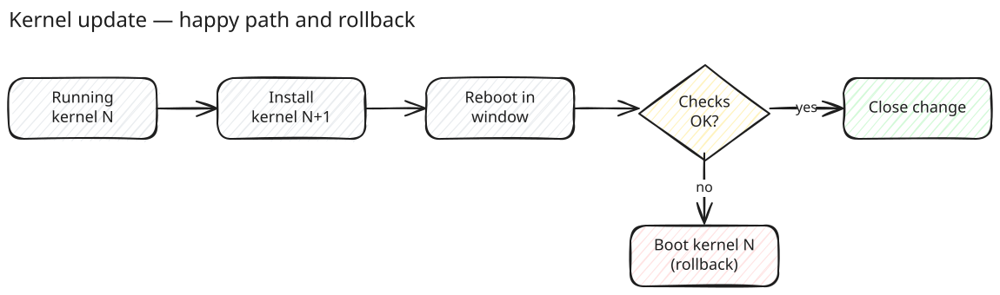

# Example: Kernel update

This page is a worked example. It documents a fictitious process — updating
the kernel on a fleet of Linux servers — and shows most of what a page in
f451 can contain. It was started from the **Process runbook** template; see
[[templates-and-metadata]] for how templates work.

> [!NOTE]
> What this page demonstrates: tables, callouts, a **draw.io** diagram
> (swimlane), an **Excalidraw** sketch, an embedded **YouTube** video and
> links to other pages. Open it in the editor to see how each is written —
> both diagrams can be edited right there.

## Profile

| Field         | Value                                           |
| ------------- | ----------------------------------------------- |
| Process ID    | OPS-LNX-001                                     |
| Process owner | Platform team                                   |
| Scope         | All Linux servers (development, staging, production) |
| Trigger       | Security advisory, vendor release, planned maintenance window |
| Purpose       | Keep every server on a current, supported and secure kernel |

## Process flow

The lifecycle as a swimlane — one lane per role. This is a **draw.io**
diagram: the image you see and its editable source live in the same file,
`_media/lifecycle.drawio.svg`, next to this page.



The technical core, sketched by hand. This one is an **Excalidraw** drawing
(`_media/rollback.excalidraw.svg`) — quicker to draw, deliberately informal.



## Steps

1. **Request** — raise a change: servers, target kernel, maintenance window, risk.
2. **Assessment and approval** — the platform team assesses; the change manager approves.
   No approval without the mandatory documents below.
3. **Preparation** — install the new kernel on development servers and run the smoke tests.
4. **Staging** — roll out to staging, run the regression tests, record the result.
5. **Production** — roll out in the approved window, one group of servers at a time.
6. **Acceptance** — the service owner confirms the functional checks.
7. **Closure** — close the change, update the inventory, attach the evidence.

> [!WARNING]
> Keep the previous kernel installed until acceptance. It is the rollback
> path: if the checks fail after the reboot, boot the previous kernel and
> reopen the change.

## Technical execution

```sh
# Record the current state
uname -r > /var/tmp/kernel-before.txt

# Install the new kernel (Debian/Ubuntu shown; adapt to your distribution)
sudo apt-get update && sudo apt-get install --only-upgrade linux-image-generic

# Reboot inside the maintenance window, then verify
sudo systemctl reboot
uname -r
systemctl --failed
```

## Responsibilities

| Activity              | Requester | Platform team | Change manager | Service owner |
| --------------------- | --------- | ------------- | -------------- | ------------- |
| Raise change          | R/A       | C             | I              | C             |
| Technical assessment  | I         | R             | A              | C             |
| Approval              | I         | C             | A/R            | C             |
| Perform update        | I         | R/A           | I              | I             |
| Functional acceptance | I         | C             | I              | R/A           |

*R = Responsible · A = Accountable · C = Consulted · I = Informed*

## Required documents

| Document                    | Mandatory | Where                  |
| --------------------------- | --------- | ---------------------- |
| Change request              | yes       | Ticket system          |
| Test record (staging)       | yes       | Attached to the change |
| Rollback plan               | yes       | This page, step 7      |
| Acceptance record           | yes       | Attached to the change |

## Background

Why the kernel matters, from the person who started it:

https://www.youtube.com/watch?v=o8NPllzkFhE

Related: [[writing-a-page]] explains how a change to this page goes through
review before it is published.
