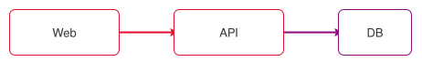

# Betriebshandbuch

Willkommen im Demo-Space **Betrieb**. Diese Seiten liegen als Markdown in einem
lokalen Forgejo-Repository und werden von der Plattform indexiert und gerendert.

## Einstieg

- [[onboarding]] — erste Schritte für neue Mitarbeitende
- [[richtlinien]] — verbindliche Regeln und Konventionen

## Architektur

Ein eingebettetes Diagramm (draw.io als SVG mit Quelle):

> [!NOTE]
> Dieser Space wurde vom Skript `scripts/dev-local-setup.sh` angelegt — er dient
> als befülltes Beispiel für den lokalen Betrieb ohne Entra.
